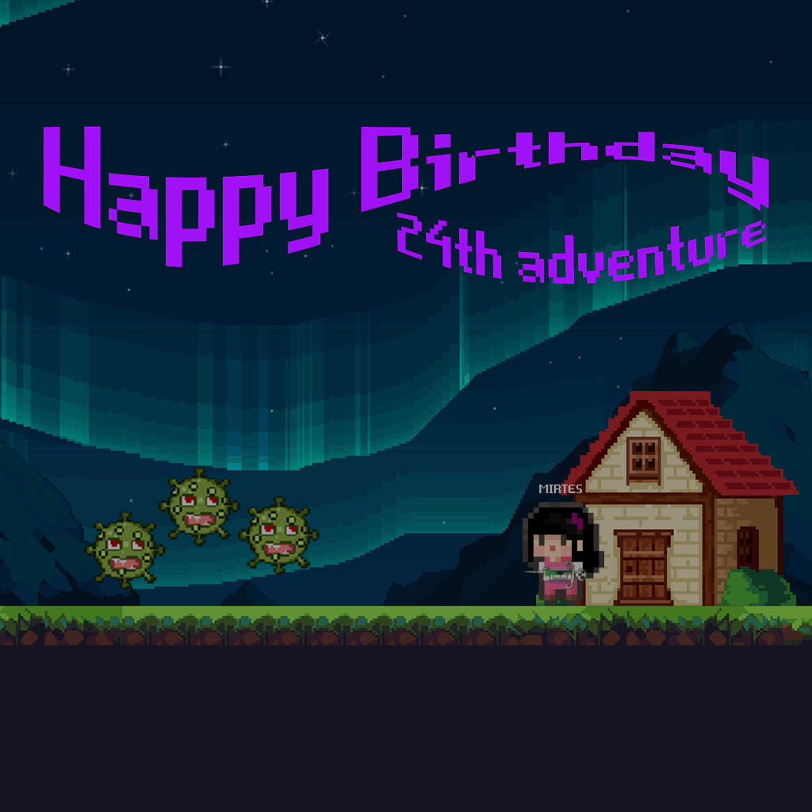
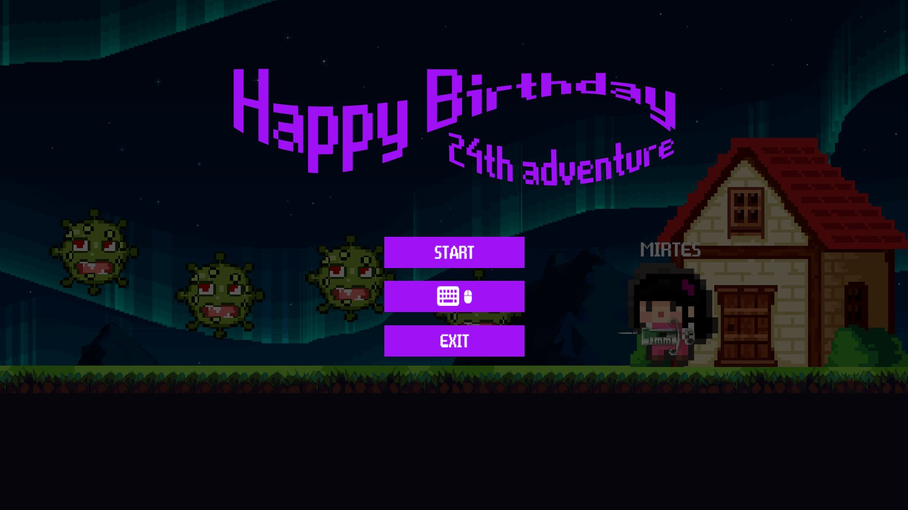
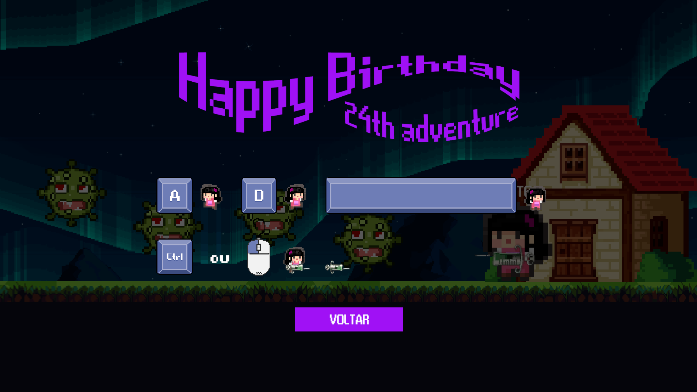
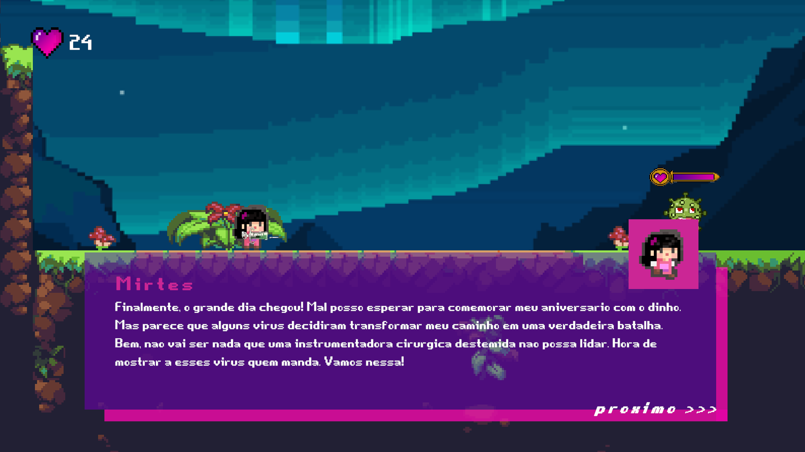
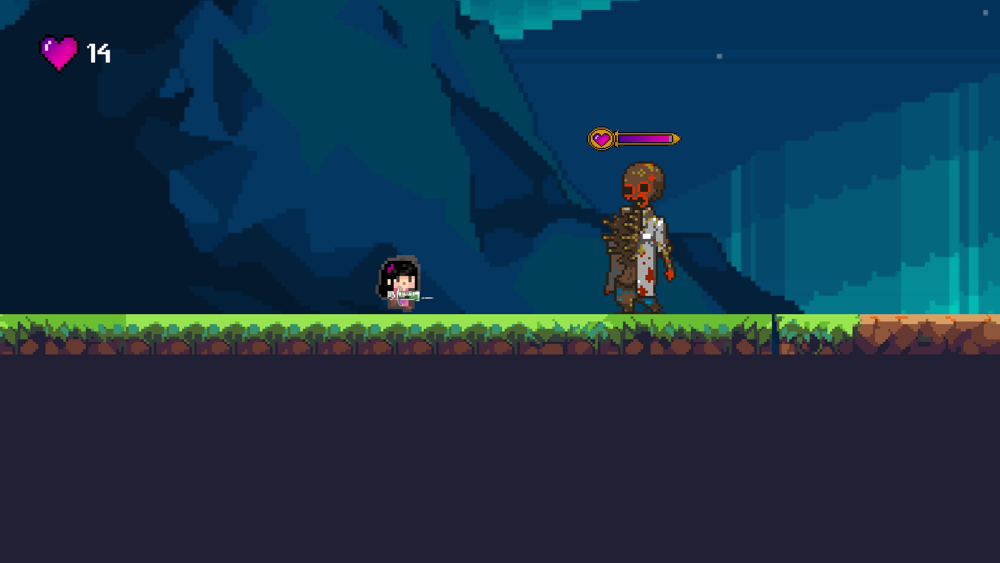
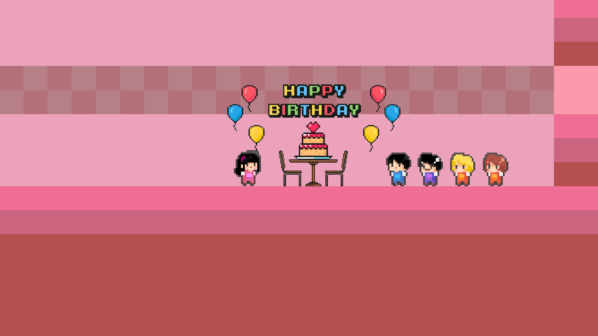

# Mirtes 24th Adventure



**Mirtes 24th Adventure** is a 2D platform game crafted with Unity. Embark on an exhilarating journey as you step into the shoes of the protagonist on her 24th birthday. She must overcome various challenges, including defeating viruses and a zombie doctor, to reach the surprise party.

## Technology

The following are the key technologies and tools used in the development of this app:

- **Unity**: Is a popular game development platform used to create both 2D and 3D games, interactive applications, simulations, and more. It provides a comprehensive set of tools for game design, animation development, physics, graphic rendering, audio, and more. With Unity, developers can create multiplatform games for desktop, mobile, web, and consoles. It supports multiple programming languages, including C#, JavaScript, and Boo, but C# is the most commonly used scripting language by Unity developers.
- **C#**: Is an object-oriented programming language developed by Microsoft. It's widely used for building applications, including games, due to its clean syntax, strong typing, automatic memory management, and extensive standard library.

## Key Features

- **Short and Sweet**: Enjoy a brief but enjoyable gameplay experience, consisting of a short battle phase followed by a celebration phase.
- **Straightforward Controls**: Use the A and D keys to move left and right. Press the spacebar to jump, and left-click the mouse to shoot the syringe.
- **Combat Phase**: Engage in a short battle against some virus and a boss zombie doctor using a syringe as your weapon.
- **Celebration Phase**: After the battle, navigate through a simple celebratory scene where you can move back and forth. Take in the festive atmosphere as you celebrate Mirtes' birthday with your family.
- **User-Friendly Interface**: Easily pause the game at any time using the Esc key. Access a simple command guide to familiarize yourself with the controls.

## How to Play

- **Battle Phase**: Use the A and D keys to move left and right. Press the spacebar to jump, and left-click the mouse to shoot the syringe at the some virus and a boss zombie doctor.
- **Celebration Phase**: Simply move left and right using the A and D keys to explore the celebration scene.
- **Pause and Commands**: Press the Esc key to pause the game at any time. Access the command guide for a quick overview of the controls.

## Screenshots

### Menu



### Commands



### Phase 1 - Dialog



### Phase 1 - Zombie Doctor (Boss)



### Phase 2 - House Party



## Installation

To run the app locally, follow these steps:

1. Clone the repository:

   ```bash
   git clone https://github.com/edsoncamargo/mirtes-24th-adventure-unity
   cd your-path/mirtes-24th-adventure-unity
   ```

2. Open the Project in Unity:

   - Open Unity Hub.
   - Click on "Open" and navigate to the directory where the repository was cloned.
   - Select the Unity project folder and click "Select Folder" to open the project in the Unity Editor.

3. Set Up the Build:

   - In the Unity Editor, go to "File" > "Build Settings."
   - Make sure all necessary scenes are included in the build.
   - Select the target platform for the build (e.g., PC, Mac, Android, iOS).

4. Run the Project:
   - After setting up the build settings, click the "Play" button in the top corner of the Unity Editor to run the project.
   - Wait for Unity to compile and run the project. The game will open in the Unity Editor's Game view.

## Contribution

You are welcome to contribute to the development of this project. If you find bugs, wish to add new features, or improve usability, feel free to open an issue or submit a pull request.

## Contact

- Name: Edson Camargo Menezes
- Email: contact@edsoncamargo.dev

## Acknowledgments

Special thanks to everyone who contributed to making this game a reality, especially my protagonist Malu Monique, I love you.

Enjoy using **Mirtes 24th Adventure!**
